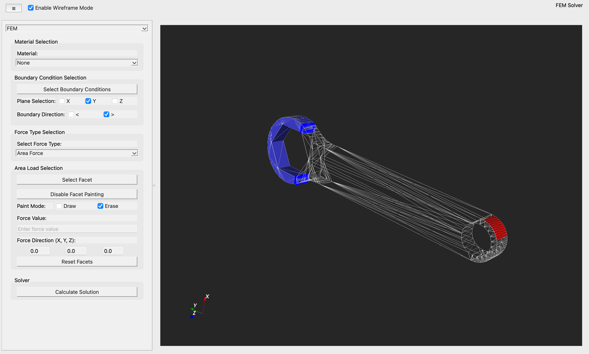
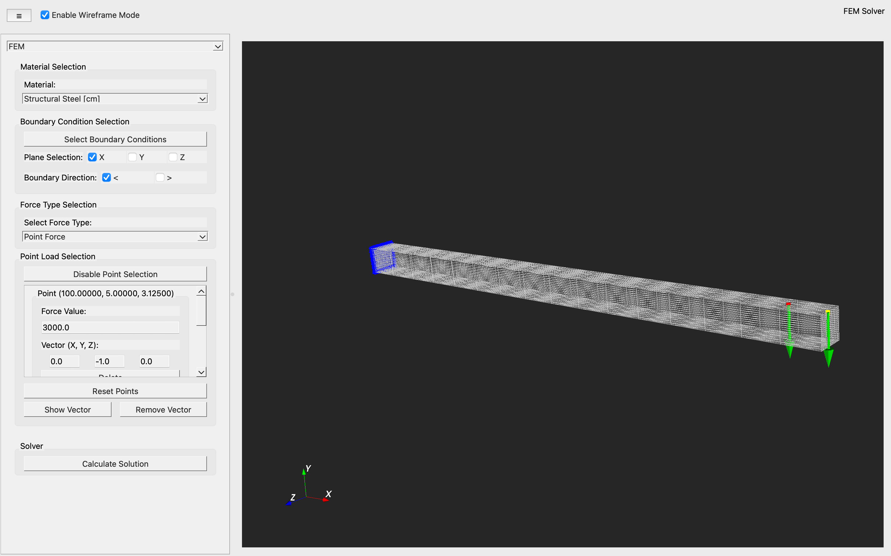
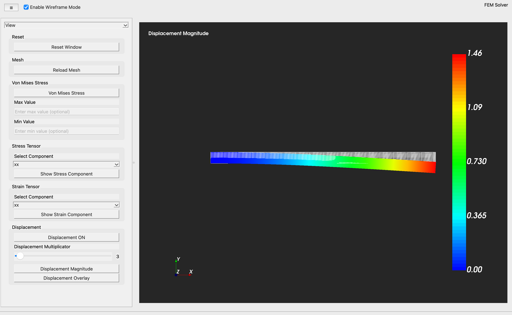
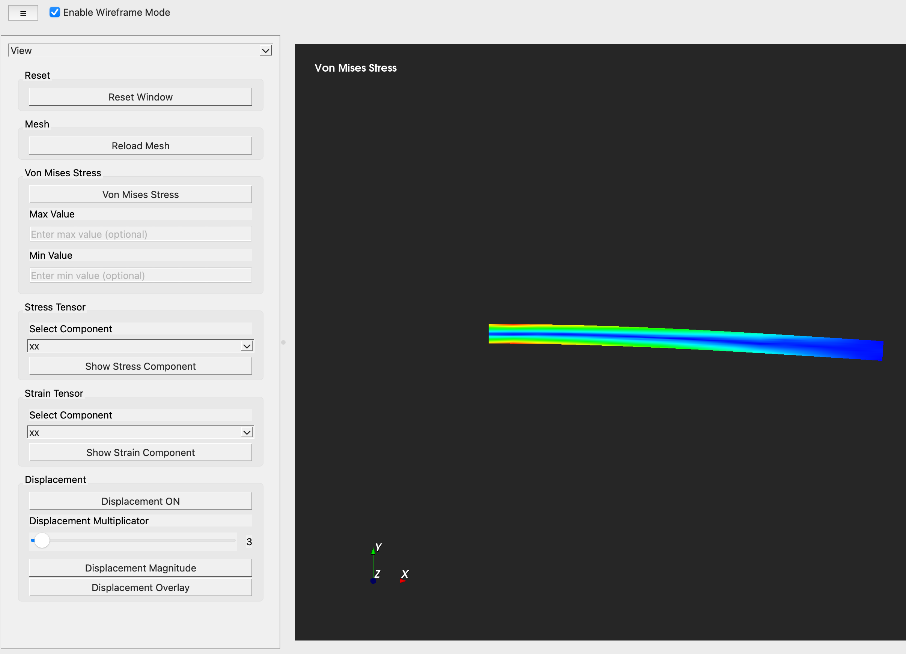

# STL FEM Solver

**STL FEM Solver** is an interactive Python-based GUI for performing Finite Element Method (FEM) simulations on STL geometries.
Built with **PySide6**, **VTK** and **FEniCS**, it integrates **Gmsh** for mesh generation and **FEniCS** for solving the underlying FEM equations.
Users can define materials, boundary conditions and point or area load and visualize results such as stresses, strains and displacements in XDMF format.
The solver automatically reports mesh quality metrics and FEM solution details.

---

## Table of Contents
- [Purpose](#purpose)
- [Features / Main Functions](#features--main-functions)
- [Screenshots](#screenshots)
- [Installation / Setup](#installation--setup)
- [Examples / Video Walkthrough](#examples--video-walkthrough)
- [Testing and Validation](#testing-and-validation)
- [Technical Details / Architecture](#technical-details--architecture)
- [Documentation and Report](#documentation-and-report)
- [Potential Extensions and Enhancements](#potential-extensions-and-enhancements)

---

## Purpose 

This project was developed to provide a user-friendly graphical interface for working with **Finite Element Models (FEM)**.  
The goal was to enable the user to load, refine, visualize and analyze FEM results such as stresses, strains and displacements in 3D.

---

## Features / Main Functions


### Geometry Import and Mesh Refinement
- **Load STL Files:** Import 3D geometries in STL format for preprocessing and simulation setup.  
- **Mesh Refinement:** Refine the imported mesh through subdivision (level 2 refinement) to improve resolution and element quality.  
- **Save Refined Mesh:** Export and reuse refined meshes for later analysis.

---

### FEM Setup and Definition
- **Material Selection:** Choose from available materials to assign material properties for FEM analysis.  
- **Boundary Conditions:**  
  - Define boundary constraints using plane-based mesh selection.  
  - Intuitive GUI interaction for applying boundary conditions.
- **Load Definition:**  
  - **Point Loads:** Apply multiple point loads, each with an independent direction vector and magnitude.  
    Visualize load directions via arrow indicators directly in the 3D scene.  
  - **Area Loads:** Apply distributed loads by selecting facets individually or using a paint tool for faster region selection.  
    Assign direction vectors and load values for the defined area.

---

### FEM Solving and Meshing
- **Tetrahedral Meshing:** Automatically generate a tetrahedral volume mesh using Gmsh before solving.  
- **Adaptive Solver Selection:** The program automatically chooses between a direct solver (for smaller meshes) and an iterative solver (for larger meshes) based on mesh size and complexity.  
- **Result Export:** The solver produces a structured results directory containing:
  - 'results_mesh.xdmf' - FEM result mesh for visualization  
  - 'mesh_quality.json' - Metrics on mesh quality  
  - 'fem_results.json' - Summary of FEM solution parameters and solver information  

---

### Visualization and Post-Processing
- **Result Visualization:** Load and explore XDMF result files with multiple visualization modes:
  - Von Mises stress
  - Stress components 
  - Strain components
  - Displacement magnitude
- **Deformation Display:**  
  - Toggle between visualizing deformed and undeformed meshes.  
  - Apply customizable displacement multipliers for exaggerated deformation visualization.  
  - Enable overlay of the original mesh to compare pre- and post-deformation geometry.
- **Result Loading:** Reload previously generated XDMF result files to review or analyze results independently of the solver.

---

### Visualization Controls and Customization
- **Rendering Options:**  
  - Change background color and mesh color for visual clarity.  
  - Switch between wireframe and solid shading modes.  
- **Selection Tools:** Easily pick points, facets or regions in the mesh for boundary condition or load assignment.

---

## Screenshots

### Area Load Example

The following figure shows the application of an area load, suitable for modeling distributed loads such as self-weight.



### Point Load Validation Case

A point load is applied at the free end of the beam to match the analytical validation model.



### Displacement Field

The displacement magnitude can be visualized either on the deformed mesh or overlaid on the undeformed configuration.



### Stress Results

Von Mises stress distribution for the validated point load case.




---

## Installation / Setup

### Requirements
- **Python:** ≥ 3.9  
- **Environment Manager:** [Anaconda](https://www.anaconda.com/download)  
- **Supported Platforms:** macOS, Linux  
- **Dependencies:** Automatically handled via `environment.yml`  
  (includes PySide6, VTK, FEniCs, Gmsh API and other required packages)

---

### Before You Begin
Make sure Anaconda is installed on your system.  
If not, download and install it from the official website

### Setup Instructions

1. **Clone the Repository**
   ```bash
   git clone https://github.com/moritzjakob/STL-FEM-Solver.git
   cd STL-FEM-Solver
   ```

2. **Create the Conda Environment**
   ```bash
   conda env create -f environment.yml
   ```

3. **Activate the Environment**
   ```bash
   conda activate stlfemsolver-env
   ```

4. **Run the Application**
   ```bash
   python -m main
   ```

---

## Examples / Video Walkthrough

- Demo Video: (https://www.youtube.com/watch?v=YOUR_VIDEO_ID)


---

## Testing and Validation

To verify the accuracy and performance of the FEM solver and meshing routines, a set of dedicated test scripts is included in the 'tests/' directory.  
These tests were also used to generate runtime and convergence data for the accompanying project report.

### Available Test Categories

**FEM Solver Tests:**  
Evaluate solver correctness and stability by comparing computed result against known analytical solution.

**Mesh Convergence Tests:**  
Study the effect of mesh refinement on solution accuracy, including convergence of stress and displacement results.

**Runtime Performance Tests:**  
Measure solver execution time and meshing time for different mesh sizes and loads.

### Note on Large Test Files

One test case used a high-resolution STL file ('beam_extreme_fine.stl') which exceeds GitHub's file size limit
and is therefore not included in this repository.

---

### Running the Tests

From the root of the project directory ('STL-FEM-Solver'), tests can be executed using the following syntax:

```bash
python -m tests.<test_filename>
```

For example:
```bash
python -m tests.validate_point_solver
```

---

## Technical Details / Architecture

**STL FEM Solver** is a modular Python-based application that combines a GUI frontend with a finite element solver backend.  

### Core Technologies
- **Programming Language:** Python 3  
- **GUI Framework:** PySide6 (Qt for Python)  
- **3D Visualization:** VTK (Visualization Toolkit)  
- **Mesh Generation:** Gmsh (via Python API)  
- **FEM Simulation:** FEniCS for solving PDEs and linear elasticity problems  
- **Package Management:** Conda environment ('environment.yml')

### Project Structure

```
STL-FEM-Solver/
|
|-- main.py                           # Application entry point
|-- environment.yml                   # Conda environment with all dependencies
|-- README.md                         # Project documentation 
|
|-- fem_app/                          # Main application source package
|   |
|   |-- core/                         
|   |   |-- app_context.py            # Manages global state, paths, and shared configuration
|   |
|   |-- fem/                          
|   |   |-- fem_base.py               # Common FEM routines and helper functions
|   |   |-- fenics_point_solver.py    # FEniCS solver implementation for point load cases
|   |   |-- fenics_area_solver.py     # FEniCS solver implementation for area load cases
|   |
|   |-- gui/                           
|   |   |-- components/               # GUI widgets (main window, header, sidebar panels)
|   |   |-- controller/               # Sidebar logic, button actions, and GUI event coordination
|   |   |-- gui_state/                # Tracks active selections, load definitions, and UI state
|   |
|   |-- mesh/                         
|   |   |-- mesh_generator.py         # Handles STL import, tetrahedral meshing and refinement via Gmsh
|   |
|   |-- renderer/                      
|   |   |-- vtk_renderer.py           # Main VTK renderer for mesh and FEM result visualization
|   |   |-- renderer_state.py         # Maintains renderer settings, view state and visualization mode
|   |   |-- renderer_controller.py    # Connects GUI inputs to rendering updates and visualization logic
|   |   |-- data/                     # File handlers for reading/writing STL and XDMF result data
|   |   |-- interactor/               # Tools for user interaction (picking, rotating, painting selections)
|   |   |-- visualization/            # Color schemes, overlays and cleanup utilities for the render window
|   |
|   |-- utils/                        
|       |-- file_utils.py             # General utility functions for file I/O and path management
|
|-- tests/                           
|   |-- test_data/                    # STL geometries and reference data used for tests
|   |-- area_facets_data.py           # Predefined facet selections for area load validation
|   |-- test_fem_area.py              # Runtime and mesh convergence tests for area load simulations
|   |-- test_fem_point.py             # Runtime and mesh convergence tests for point load simulations
|   |-- test_mesh_runtime.py          # Performance benchmark for mesh generation routines
|   |-- validate_point_solver.py      # Analytical vs FEM comparison for solver validation
|
|-- docs/                             # Final project report
|
|-- examples/                         # Example files and video walkthroughs
```

---

## Documentation and Report
For a complete description of the project design, implementation and validation results, see the [Project Report (PDF)] [insert here].

---

## Potential Extensions and Enhancements

While the current version of **STL FEM Solver** provides a robust platform for structural FEM analysis, several improvements and extensions are possible directions for future development:

- **Advanced Mesh Refinement Tools**  
  Introduce more interactive and automated mesh refinement techniques (e.g., local refinement, curvature-based refinement and adaptive remeshing) to improve simulation accuracy and mesh quality.

- **Mesh Failure Insights**  
  Add detailed diagnostic messages and graphical overlays to explain why meshing may have failed (e.g., intersecting geometry, insufficient resolution or invalid STL topology).

- **Extended Material Library and Nonlinear Behavior**  
  Incorporate more material models, including plasticity and hyperelasticity to enable nonlinear FEM simulations.

- **Expanded Boundary Condition Options**  
  Support additional boundary condition types (e.g., temperature and pressure constraints) and allow combined or spatially varying conditions.

- **Multi-Object FEM Simulation:**  
  Enable support for multiple geometries within the same simulation.  
  This would allow interaction between separate bodies, such as contact or load transfer 

- **Additional FEM Analysis Modes**  
  Extend beyond linear static structural analysis to include thermal, modal and transient simulations, providing a broader range of engineering applications.

- **Performance and Parallelization**  
  Explore multi-threading and solver parallelization to handle larger, more complex models efficiently.

---


